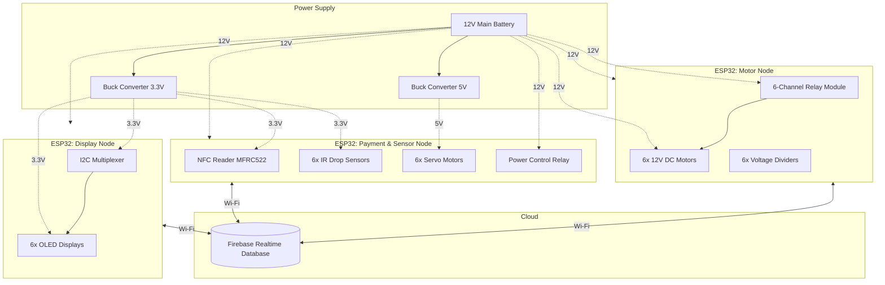

# Intelligent-Retail-Automation-Platform

This repository contains the source code for a custom IoT vending machine. The project is split into two main parts: the ESP32 hardware controller and a web-based interface (customer kiosk and admin dashboard). It uses Firebase for real-time data syncing.

## Features
* **Hardware Control:** C++ firmware for the ESP32 to handle sensors, motors, and dispensing logic.
* **Cloud Sync:** Firebase integration to track inventory and sales in real time.
* **Customer UI (Kiosk):** Frontend interface for users to browse and select products.
* **Admin Dashboard:** Web panel to monitor stock levels, manage inventory, and check the machine status remotely.

## Project Structure
* `/Firmware` - ESP32 C++ source code (ready to be flashed via Arduino IDE or PlatformIO).
* `/Web` - Frontend files (HTML, CSS, JavaScript) for both the kiosk and the admin panel.

## Hardware Components
Here is the list of the main electronic components used for this build:
* 3x ESP32 (e.g., NodeMCU / WROOM-32)
* 3x expansion board CH340C for ESP32
* 6x 12V DC Gear Motors with Dispensing Coils
* 6x TCRT5000 IR Sensors 
* 6x MG90 180° servomotors
* 6x 0.96" OLED Displays (I2C / SSD1306)
* 1x TCA9548A I2C Multiplexer
* 1x MFRC522 NFC/RFID Reader Module
* 1x Power Supply Unit (e.g., 5V/12V)
* 2x buck converters
* 6x voltage dividers from 12V to 3.3V
* **Misc:** Relays, breadboards, jumper wires, custom 3D printed parts.

---

## Setup Instructions

### Prerequisites (Libraries)
To compile the firmware, make sure to install the following libraries via the Arduino IDE Library Manager:
* `Firebase_ESP_Client.h`
* `MFRC522.h`
* `ESP32Servo.h`
* `Adafruit_SSD1306.h`
* `Adafruit_GFX.h`
* `WiFi.h`
* `Wire.h`
* `SPI.h`

For security reasons, API keys and Wi-Fi credentials are not included in this repository. 

### 1. Firmware Setup (ESP32)
1. Go to the `/Firmware` folder.
2. Find the template file (e.g., `secrets_template.h`).
3. Rename it to `secrets.h` (make sure to remove `_template` from the filename).
4. Open `secrets.h` and fill in your Wi-Fi credentials and Firebase API keys.
5. Compile and upload the code to your ESP32.

### 2. Web Setup (Firebase)
1. Go to the `/Web` folder.
2. Find the configuration template file (e.g., `firebase_template.js`).
3. Rename it to `firebase.js`.
4. Open the file and paste your Firebase project configuration object.
5. Find the totem_app folder and open `script.js`.
6. Paste your Firebase project configuration object.

### 3. Firebase Database Structure
For the system to work correctly, your Firebase Realtime Database must follow a specific structure for inventory, machine status, and transactions. 
To easily set this up:
1. Locate the `database_structure_template.json` file in the root folder of this repository.
2. Go to your Firebase Console -> Realtime Database.
3. Click the three vertical dots (`⋮`) in the top right corner of the data window and select **Import JSON**.
4. Upload the `database_structure_template.json` file to instantly generate the required nodes.

---

## System Architecture & Wiring

This project uses a **Cloud-Native Distributed Architecture**. Instead of relying on complex physical wiring (like I2C or UART) between the microcontrollers, the system is fully decoupled. All three ESP32 boards connect directly to Wi-Fi and synchronize their states in real-time via the **Firebase Realtime Database**.

### High-Level Block Diagram

## Running the Project
* **Hardware:** Power up the ESP32. Once connected to Wi-Fi, it will automatically sync with Firebase.
* **Web:** Open the HTML files in your browser. It is highly recommended to use a local server (like the VS Code *Live Server* extension) to avoid local CORS restrictions.

---

## DIFFERENT BOARDS WIRING AND PINOUT

### Display Board 
This board exclusively handles the user interface. It maintains a continuous connection to the database to fetch and render price updates in real time across the entire display array.

* Power Distribution: The ESP32 is powered directly from the main battery source. To ensure stable current delivery and prevent MCU regulator overload, the TCA9548A multiplexer and all six OLED screens are powered via a dedicated 3.3V step-down buck converter.

**Pin Mapping:**
* `GPIO 21` ➔ TCA9548A (`SDA`)
* `GPIO 22` ➔ TCA9548A (`SCL`)

### Motor Board 
This board manages the physical dispensing mechanism. It controls six 12V DC motors via a relay module and monitors their physical rotation to guarantee accurate product delivery.

* Feedback & Protection: When a motor completes a full rotation, a built-in limit switch triggers a 12V signal. To safely read this without frying the MCU, the signal is stepped down to 3.3V logic using a network of voltage dividers before reaching the ESP32.
* Dispensing Logic: The firmware implements a state machine capable of multi-item dispensing (up to 4 products sequentially). It includes a 1-second blind-spot delay to allow the cam to clear the switch, and a 5-second timeout safety feature that kills the power to prevent hardware damage in case of a product jam.

**Pin Mapping:**

*Relays (Outputs):*
* `GPIO 13` ➔ Relay 1 (Motor 1)
* `GPIO 14` ➔ Relay 2 (Motor 2)
* `GPIO 16` ➔ Relay 3 (Motor 3)
* `GPIO 17` ➔ Relay 4 (Motor 4)
* `GPIO 25` ➔ Relay 5 (Motor 5)
* `GPIO 26` ➔ Relay 6 (Motor 6)

*Limit Switches (Inputs via Voltage Dividers):*
* `GPIO 34` ➔ Feedback 1 (Motor 1)
* `GPIO 35` ➔ Feedback 2 (Motor 2)
* `GPIO 36` ➔ Feedback 3 (Motor 3)
* `GPIO 39` ➔ Feedback 4 (Motor 4)
* `GPIO 32` ➔ Feedback 5 (Motor 5)
* `GPIO 33` ➔ Feedback 6 (Motor 6)

### Payment Board 
This is the board that acts as the financial controller. It manages NFC card reads, physical coin validation, and physical change dispensing via servos. 

* Dual-Core RTOS Architecture: To guarantee zero missed coins during hardware polling, the firmware utilizes FreeRTOS. Network operations (WiFi/Firebase synchronization) are pinned to Core 0 as a background task, ensuring the main loop running on Core 1 can read fast IR coin interrupts without being blocked by network latency.
* Power Management & Safety: To minimize power draw, the 3.3V buck converter and all 3.3V sensors are kept unpowered during idle states. A relay activates them only when a transaction begins. The state machine explicitly implements a 1.5-second buffer after power-up to prevent voltage spikes from registering as phantom coin insertions.
* Dispensing Algorithm: Calculates the required change and iterates through a greedy algorithm, triggering the corresponding servo motors to release physical change sequentially.

**Pin Mapping:**

*Power Control:*
* `GPIO 4`  ➔ Power Relay (Activates 3.3V sensor rails)

*NFC Reader (SPI Bus - MFRC522):*
* `GPIO 5`  ➔ MFRC522 (`SDA / SS`)
* `GPIO 14` ➔ MFRC522 (`SCK`)
* `GPIO 13` ➔ MFRC522 (`MOSI`)
* `GPIO 16` ➔ MFRC522 (`MISO`)
* `GPIO 17` ➔ MFRC522 (`RST`)

*Change Dispenser (Servo Outputs):*
* `GPIO 18` ➔ Servo 1 (€2.00)
* `GPIO 19` ➔ Servo 2 (€1.00)
* `GPIO 21` ➔ Servo 3 (€0.50)
* `GPIO 22` ➔ Servo 4 (€0.20)
* `GPIO 23` ➔ Servo 5 (€0.10)
* `GPIO 25` ➔ Servo 6 (€0.05)

*Coin Acceptor (IR Sensor Inputs):*
* `GPIO 26` ➔ IR Sensor 1 (€0.10)
* `GPIO 27` ➔ IR Sensor 2 (€0.05)
* `GPIO 32` ➔ IR Sensor 3 (€0.20)
* `GPIO 33` ➔ IR Sensor 4 (€0.50)
* `GPIO 34` ➔ IR Sensor 5 (€1.00)
* `GPIO 35` ➔ IR Sensor 6 (€2.00)

## Acknowledgments
* The 3D printed coin sorting and distribution mechanism design is based on the [Munt-sorteer--en-opslagsysteem](https://github.com/TiebeDeclercq/Munt-sorteer--en-opslagsysteem/tree/main) by TiebeDeclercq.

## License
* This project is licensed under the MIT License.

## Authors
* Daniel Pandolfo - Carlotta Caruso
